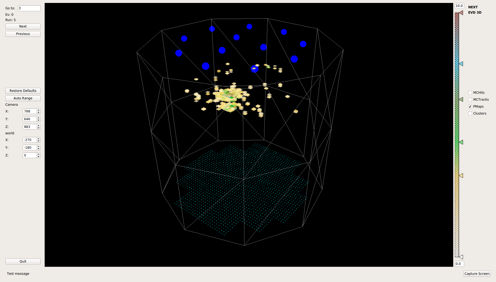

# ic-viewer

This repository is a 3D viewer for NEXT-NEW data and simulation in the .h5 format.  See the example image below.  The requirements lists the dependencies and how to install them.

Example Image:

  

